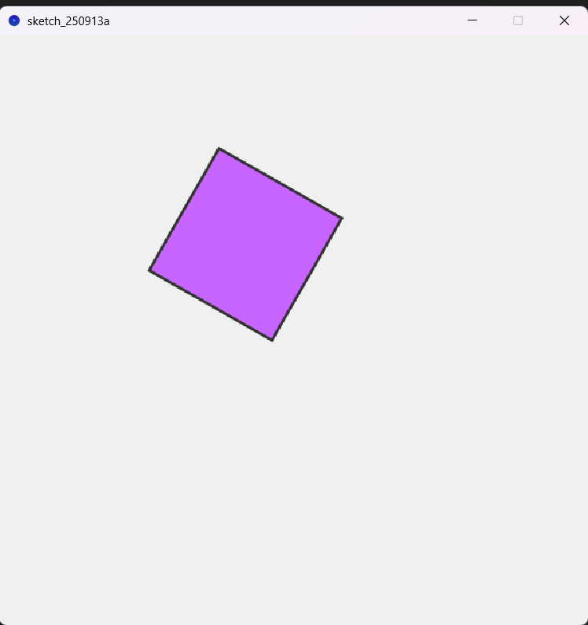

---

## 🎨 Implementación en Processing (2D)

### Herramientas usadas
- [Processing](https://processing.org/) → entorno visual de programación.

### Descripción
1. Se creó un sketch en Processing (2D ).
2. Se dibujó una figura geométrica (`rect` en 2D).
3. Se aplicaron transformaciones animadas:
   - Traslación en trayectoria circular (`sin`, `cos`).
   - Rotación continua (`rotate`, `rotateX`, `rotateY`).
   - Escalado dinámico (`sin` en función del tiempo).
4. Se usaron `pushMatrix()` y `popMatrix()` para aislar transformaciones.

### Captura de ejemplo


### Código relevante
```java
float t = millis() / 1000.0;
translate(width/2 + sin(t)*100, height/2 + cos(t)*100);
rotate(t);
scale(1 + 0.5*sin(t*2));
rect(0, 0, 100, 100);
