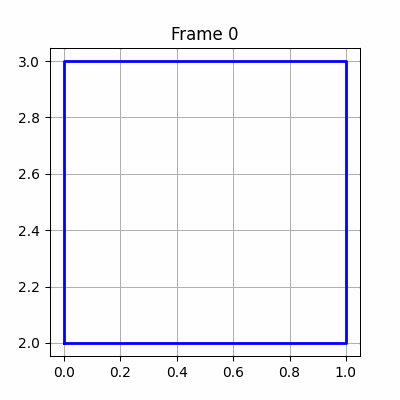

# 🧪 Taller 1 - Transformaciones Básicas en Computación Visual

## 🔍 Objetivo
Explorar transformaciones geométricas básicas (**traslación, rotación y escala**) aplicadas a una figura en 2D.  
El resultado final es una animación en formato **GIF** donde la figura cambia en el tiempo.

---

## 💻 Implementación en Python

### Herramientas usadas
- [Matplotlib](https://matplotlib.org/) → para graficar figuras 2D.
- [NumPy](https://numpy.org/) → para operaciones con matrices de transformación.
- [ImageIO](https://imageio.readthedocs.io/) → para generar GIF animados.

### Descripción
1. Se definió una figura base (un **cuadrado** en coordenadas homogéneas).  
2. Se implementaron las **matrices de transformación**:
   - Traslación
   - Rotación
   - Escalado
3. Se aplicaron en un bucle dependiente del tiempo `t`:
   - Rotación creciente en cada frame.
   - Traslación oscilante con funciones seno y coseno.
   - Escalado dinámico con una función seno.
4. Se exportó el resultado como **GIF animado**.

### Captura de ejemplo
 



### Código relevante
```python
transform = translation_matrix(tx, ty) @ rotation_matrix(angle) @ scale_matrix(scale, scale)
transformed_square = square @ transform.T
